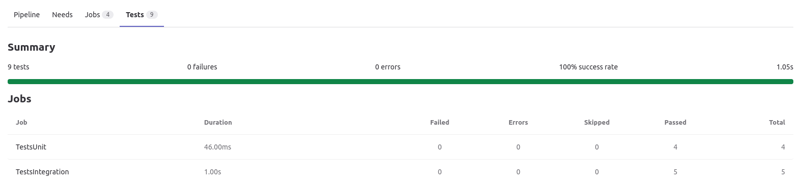
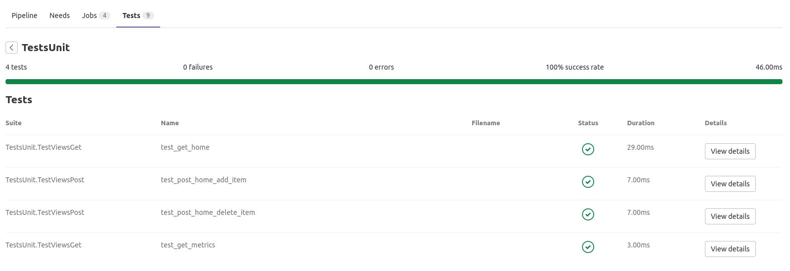
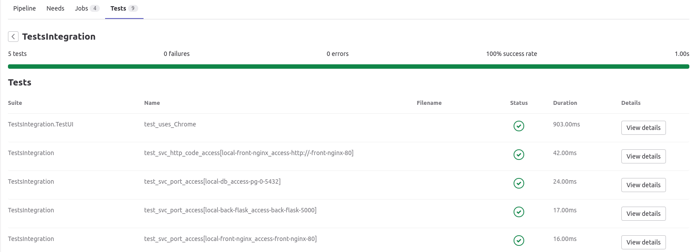

Протестировать тестовый сервис из двух микросервисов // ДЗ
-------------
### Цель:
1. Написать юнит-тесты к этой паре микросервисов

2. Написать контракт (и проверить его)

3. *Настроить отказоустойчивую балансировку инстансов одного из сервиса и устроить chaos

### Результаты:
#### Для проэкта [flask-sqlite3-todo-crud](https://gitlab.com/kyourselfer/otus_sre202207/) из [2-го ДЗ](https://github.com/kyourselfer/OTUS_SRE202207/tree/main/03_basic-of-SRE)

#### Написаны Unit тесты [TestUnit.py](https://gitlab.com/kyourselfer/otus_sre202207/-/blob/main/tests/TestsUnit.py) для [app.py](https://gitlab.com/kyourselfer/otus_sre202207/-/blob/main/app/app.py):
- TestViewsGet:test_get_home. По средством `testing_client`, на `/` получается `GET` и проверяется assert на наличие кнопок "Submit new item", "Submit new item" 
- TestViewsGet:test_get_metrics. По средством `testing_client`, на `/metrics` получается `GET` и проверяется assert на наличие строки "flask_exporter_info"
- TestViewsPost:test_post_home_add_item. По средством `testing_client`, на `/add` отправляется `POST` с текстом "TEST.ADD_NEW_STRING" и проверяется assert на наличие ответа 302
- TestViewsPost:test_post_home_delete_item. По средством `testing_client`, на `/delete` отправляется `POST` с текстом "TEST.ADD_NEW_STRING" и проверяется assert на наличие ответа 302

#### Написаны и проверены Integration тесты [TestsIntegration.py](https://gitlab.com/kyourselfer/otus_sre202207/-/blob/main/tests/TestsIntegration.py):
- TestsIntegration:test_svc_port_access[local-db_access-pg-0-5432]. По средством `pytest` сделаны проверки резолвинга, доступности порта `tcp\5432` с тестового контейнера к контейнеру `pg-0`
- TestsIntegration:test_svc_port_access[local-back-flask_access-back-flask-5000]. По средством `pytest` сделаны проверки резолвинга, доступности порта `tcp\5000` с тестового контейнера к контейнеру `back-flask`
- TestsIntegration:test_svc_port_access[local-front-nginx_access-front-nginx-80]. По средством `pytest` сделаны проверки резолвинга, доступности порта `tcp\80` с тестового контейнера к контейнеру `front-nginx`
- TestsIntegration:test_svc_http_code_access. По средством `pytest`, `request` сделана проверка на наличие `http ответа 200` с тестового контейнера к контейнеру `front-nginx`
- TestsIntegration.TestUI:test_uses_Chrome. По средством `selenium.webdriver.Сhrome` с тестового контейнера к контейнеру `front-nginx` сделаны проверки:
  - на наличие в тэге html `title` слова "Title"
  - на отображение тэга `body`
  - на отображение CSS `make-todo` (форма для кнопки - добавления записи)
  - на отображение CSS `delete-todo` (форма для кнопки - удаления записи)

#### Docker окружение не настроено в режиме HA
- pg-0, pg-1 в [docker-compose.yml]() имеется инсталяция repmgr+Master+Slave (AutoFailOver не проверен)
- back-flask(app.py) не адресуется на LB(nginx) подлючённым общим volume(аналогия share-storage / lun0)
- nginx не настроен как LB для кластеров: PG, back-flask
- Возможно для роли LB нужен Keepalive/Pacemaker(RA:VirtualIP)

Описание
------------
ДЗ реализовано на основании готового кода, благодаря разработчику [Zenahr](https://github.com/Zenahr/flask-sqlite3-todo-crud) 

Требования
------------
Packages version min.: python 3.6, pip 3.9

Запуск (как продеплоить приложение)
------------
`git remote add origin https://gitlab.com/kyourselfer/otus_sre202207.git`

`git branch -M main`

`git push -uf origin main`

`docker-compose up -d`

Лицензия
-------------
BSD 2-Clause LicenseZZ

Автор
-------------
Eliseev V.A.